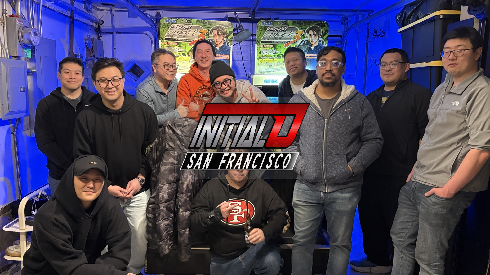

# Initial D San Francisco

> Community leaderboard, video archive, and racer profiles for Initial D Arcade Stage Version 3 players in the SF Bay Area.

**Live site:** [initialdsanfrancisco.com](https://initialdsanfrancisco.com)

---

## What This Is

A static website tracking time attack records, battle history, and video footage for a local Initial D V3 crew. The leaderboard pulls live from a Google Sheet, videos come from our YouTube channel, and racer profiles are generated at deploy time.

No logins, no databases, no frameworks — just HTML, CSS, and JavaScript.

---

## Tech Stack

- **Frontend** — Plain HTML / CSS / JS, no build step for local dev
- **Data** — Google Sheets via the `gviz/tq` JSONP API (no server required)
- **Videos** — YouTube Data API v3, cached in `localStorage` with a 1-hour TTL
- **World records** — [idrankings.com](https://idrankings.com) public REST API, cached 24h
- **Hosting** — Netlify (static deploy, `node build.js` runs at deploy time)
- **Analytics** — Google Analytics 4

---

## Running Locally

No build step needed for local development. The leaderboard and videos load client-side from Google Sheets and YouTube.

```bash
python3 -m http.server 3456
# then open http://localhost:3456
```

The YouTube video section requires a configured API key (see `data/videos.js`). Without it, the rest of the site works fine.

---

## Netlify Build

Netlify runs `node build.js` (Node 18+) before each deploy. The build script:

- Fetches leaderboard data from Google Sheets
- Generates `/racers/[slug].html` — one static profile page per player
- Generates `/courses/[slug].html` — one static page per course
- Generates `/courses.html` — course directory index
- Injects JSON-LD structured data into `index.html` and `videos.html`
- Regenerates `sitemap.xml`

**Environment variables required in Netlify:**

| Variable | Description |
|----------|-------------|
| `YOUTUBE_API_KEY` | YouTube Data API v3 key |
| `YOUTUBE_CHANNEL_ID` | Channel ID for the [@InitialDSanFrancisco](https://www.youtube.com/@InitialDSanFrancisco) channel |

Without these, the build still succeeds but generated pages won't include video links.

---

## Project Structure

```
index.html          Main page — leaderboard, racer grid, battle standings
videos.html         Full video archive with category/course/player filters
courses.html        Course directory (build-generated)
css/style.css       All styles; CSS custom properties in :root
js/main.js          Leaderboard, racer modal, URL deep-link logic
js/videos.js        Videos page filter + URL param logic
js/youtube.js       YouTube API fetch + localStorage cache
js/world-records.js idrankings.com fetch + localStorage cache
data/videos.js      YouTube API key + channel ID config
build.js            Netlify build script
racers/             Build-generated racer profile pages
courses/            Build-generated course pages
Headshots/          Player headshot images
Courses/            Course map images
```

For a full technical reference — Google Sheets setup, player roster, video title conventions, known quirks — see [`CLAUDE.md`](CLAUDE.md).

---

## Adding a Player

1. Add a headshot to `Headshots/`
2. Add an entry to the `RACERS` array in `js/main.js`
3. Make sure their name matches how they appear in the Google Sheet

See `CLAUDE.md` for the full roster conventions and edge cases.

---

## Data Sources

- **Leaderboard sheet** — [Google Sheets](https://docs.google.com/spreadsheets/d/1MaofC1e4XlJ3XtKAokq34Q3q5vTziuz8NNPS7tHZD3E) (published to web, fetched via gviz/tq)
- **YouTube channel** — [@InitialDSanFrancisco](https://www.youtube.com/@InitialDSanFrancisco)
- **World records** — [idrankings.com](https://idrankings.com/initiald/v3/rankings)

---

## License

MIT — see [LICENSE](LICENSE).
